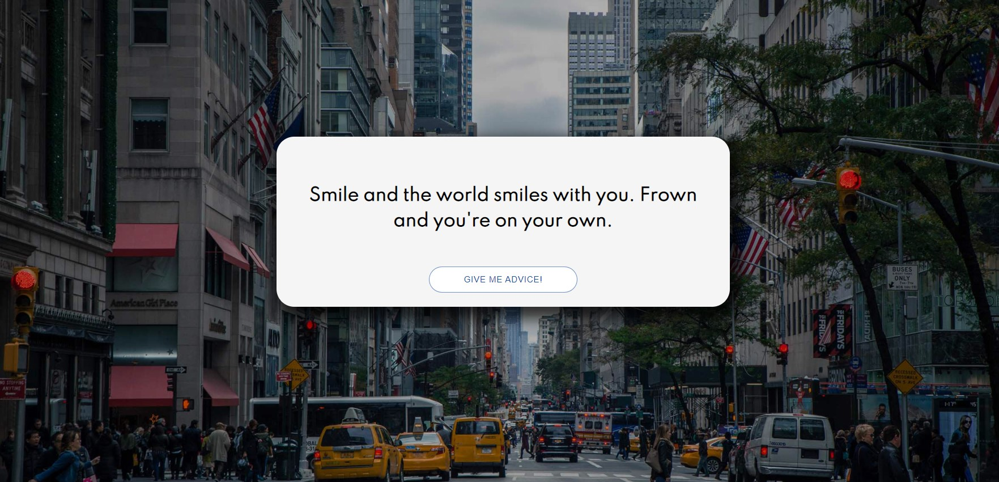

# JavaScript Mastery - Random Quote Generator

This is a Random Quote Generator / React Advice App.<br>
We use React on the front end and we make get requests to Advice Slip JSON API.<br>
Big thanks to [JavaScript Mastery](https://www.youtube.com/channel/UCmXmlB4-HJytD7wek0Uo97A) for project tutorial.

## Table of contents

- [Overview](#overview)
  - [Screenshot](#screenshot)
  - [Links](#links)
  - [Built with](#built-with)
  - [What I learned](#what-i-learned)
- [Author](#author)

## Overview

### Screenshot



### Links

- Solution: [GitHub](https://github.com/MariusDevelops/random-quote-generator)
- Live: [Random Quote Generator](https://mariusdevelops.github.io/random-quote-generator/)

### Built with

- [React](https://reactjs.org/) - JS library
- [Sass](https://sass-lang.com/) - Syntactically Awesome Style Sheets
- [API](https://api.adviceslip.com/) - Advice Slip JSON API

### What I learned

How to use lifecycles:

```JS
 componentDidMount() {
    this.fetchAdvice();
  }
```

How to use state:

```JS
 state = { advice: "" };
  }
```

How to create method that fetches data from API:

```JS
 fetchAdvice = () => {
    axios
      .get("https://api.adviceslip.com/advice")
      .then((response) => {
        const { advice } = response.data.slip;
        this.setState({ advice });
      })
      .catch((error) => {
        console.log(error);
      });
  };
  }
```

## Author

- Website - [Marius Bražas](https://mariusdevelops.github.io/)
